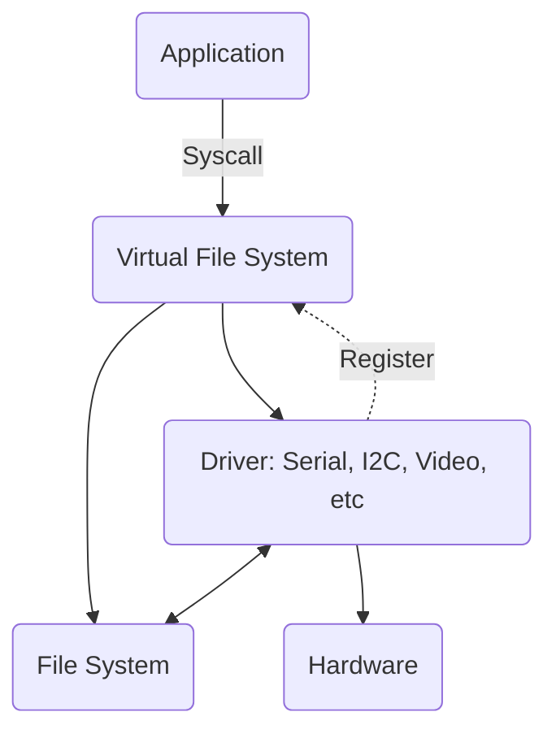

# Presenting ZealOS
## What?

ZealOs is a small operating system written in Z80 assembly for any Z80 system. It has been designed around simplicity and portability.

## Why?

As you may know, this project is in fatc part of a bigger project called Zeal 8-bit Computer, which, as it name states, consists of an entirely newly designed 8-bit computer. It is based on a Z80 CPU.

When writing softwares or demos for it, the code was tied to Zeal 8-bit computer hardware implementation, making them highly incompatible with other Z80 computers.

## Yet another OS?

Well, it's true that there are several (good) OS for the Z80 already such as SymbOS, Fuzix or even CP/M, but I wanted something less sophisticated:
not multithreaded, not entirely disk based but still modular.
The goal is to have a small and concise ABI that lets write software that can communicate with the hardware easily and with the least hardcoded behaviors.

## Requirements

In order to port ZealOS to a nea Z80 computer, a few requirements are needed: 

* Z80 CPU (of course)
* Minimum *KB of non-volatile storage, to store the OS
* Minimum *KB of RAM, for the system

# Kernel Implementation

## Used registers

Z80 presents multiple general-purpose registers, not all of them are used in the system, here is the scope of each of them:

| Register | Scope  | 
| -------- | ------ |
| AF, BC, DE, HL     | System & application           |
| AF', BC', DE', HL' | Interrupt handlers             |
| IX, IY             | Application (unused in the OS) |

This means that the OS won't alter IX and IY registers, so they can be used freely in the application.

The alternate registers (names followed by `'`) may only be used in the interrupt handlers[^1]. An application should not use these registers. If for some reasons, you still have to use them, please consider disabling the interrupts during the time they are used:

```
my_routine:
                di              ; disable interrupt
                ex af, af'      ; exchange af with alternate af' registers
                [...]           ; use af'
                ex af, af'      ; exchange them back
                ei              ; re-enable interrupts
```

Keep in mind that disabling the interrupts for too long can be harmful as the system won't receive any signal from hardware (timers, keyboard, GPIOs...)

[^1]: They shall **not** be considered as non-volatile nonetheless. In other words, an interrupt handler shall not make the assumption that the data it wrote inside any alternate register will be kept until the next time it is called.

## Memory mapping

TODO

## Reset vectors

The Z80 provide 8 distinct reset vectors, as the system is meant to be stored in the first *KB of memory, they shall all be reserved to the system:

Vector | Usage 
------ | ------
$00 | Software reset
$08 | Syscall
$10 | Breakpoint
$18 | _Unused_
$20 | _Unused_
$28 | _Unused_
$30 | _Unused_
$38 | Reserved for Interrupt Mode 1

## Syscalls

The system relies on syscalls in order to perform operation on the hardware. The list of possible operations are listed in the table below.

### Syscall table

Num  | Name | Param. 1 | Param. 2 | Param. 3 
--------| ----- | --------| ---- | ----
0 | read | u8 dev | u16 buf | u16 size |
1 | write | u8 dev | u16 buf | u16 size |
2 | open | u16 name | u8 flags | |
3 | close | u8 dev | | |
4 | dstat | u8 dev | u16 dst | |
5 | stat | u16 name | u16 dst | |
6 | seek | u8 dev | u32 offset | u8 whence |
7 | ioctl | u8 dev | u8 cmd | u16 arg |
8 | mkdir | u16 path | | |
9 | getdir | u16 path | u16 size | |
10 | chdir | u16 path | | |
11 | rddir | u16 path | | |
12 | rm | u16 path | | |
13 | mount | u8 dev | u8 letter | u8 fs |
14 | exit | | | |
15 | exec | u16 name | u16 argv | |
16 | dup | u8 dev | u8 ndev | |
17 | msleep | u16 duration | | |
18 | settime | u8 id | u16 time | |
19 | gettime | u8 id | u16 time | |
20 | map | u16 dst | u24 src | |

Please check the [System API](#system-api) for more information about each of these call and their parameters.

**NOTE**: Some syscalls may be unimplemented. For example, on computers where directories are not supported,directories-related syscalls may be omitted. 

### Syscall instruction

In order to perform a syscall, the operation number must be stored in register `L`, the parameters must be stored following these rules:

| Parameter name in API | Z80 Register |
| --------------------- | ------------ |
| u8 dev                | `H`          |
| u8 ndev               | `E`          |
| u8 flags              | `H`          |
| u8 cmd                | `C`          |
| u8 letter             | `D`          |
| u8 fs                 | `E`          |
| u8 id                 | `H`          |
| u8 whence             | `H`          |
| u16 buf               | `DE`         |
| u16 size              | `BC`         |
| u16 name              | `BC`         |
| u16 dst               | `DE`         |
| u16 arg               | `DE`         |
| u16 path              | `DE`         |
| u16 argv              | `BC`         |
| u16 duration          | `BC`         |
| u16 time              | `BC`         |
| u24 src               | `HBC`        |
| u32 offset            | `BCDE`       |


And finally, the code must perform a `RST $08` instruction (please check [Reset vectors](#reset-vectors)).

The returned value is placed in A. The meaning of that value is specific to each call, please check the documentation of the concerned function for more information. 

## Virtual File System

As the communication between applications and hardware is all done through the syscalls described above, we need a layer between the user application and the kernel that will determine whether we need to call a driver or a file system. Before showing the hierarchy of such architecture, let's talk about disks and drivers.

### Disks

ZealOS supports up to 26 disks at once. The disks are denoted by a letter, from A to Z. It's the disk's driver that decides where to mount its disk in the system. 

The first drive, `A`, is special as it is the one where the system will look for preferences or configuration.

In an application, a `path` may be:

* Relative to the current path, e.g. `my_dir2/file1.txt`
* Absolute, referring to the current disk, e.g. `/my_dir1/my_dir2/file1.txt`
* Absolute, referring to another disk, e.g. `B:/your_dir1/your_dir2/file2.txt`

### Drivers

A driver consists of a structure containing:

* Name of the driver, maximum 4 characters (filled with NULL char if shorter). For example, `SER0`, `SER1`, `I2C0`, etc. Non-ASCII characters are allowed but not advised.
* The address of an `init` routine, called when the kernel boots.
* The address of `read` routine, where parameters and return address are the same as in the syscall table.
* The address of `write` routine, same as above.
* The address of `open` routine, same as above.
* The address of `close` routine, same as above.
* The address of `seek` routine, same as above.
* The address of `ioctl` routine, same as above.
* The address of `deinit` routine, called when unloading the driver.

Here is the example of a simple driver registration:
```C
my_driver0_init:
        ; Register itself to the VFS
        ; Do something
        xor a ; Success
        ret
my_driver0_read:
        ; Do something
        ret
my_driver0_write:
        ; Do something
        ret
my_driver0_open:
        ; Do something
        ret
my_driver0_close:
        ; Do something
        ret
my_driver0_seek:
        ; Do something
        ret
my_driver0_ioctl:
        ; Do something
        ret
my_driver0_deinit:
        ; Do something
        ret

SECTION DRV_VECTORS
DEFB "DRV0"
DEFW my_driver0_init
DEFW my_driver0_read
DEFW my_driver0_write
DEFW my_driver0_open
DEFW my_driver0_close
DEFW my_driver0_seek
DEFW my_driver0_ioctl
DEFW my_driver0_deinit
```

Registering a driver consists of putting these information (structure) inside a section called `DRV_VECTORS`. The order is very important as any driver dependency shall be resolved at compile-time. For example, if driver `A` depends on driver `B`, then `B`'s structure must be put before `A` in the section `DRV_VECTORS`.

### Architecture of the VFS

The different layers can be seen like this:

