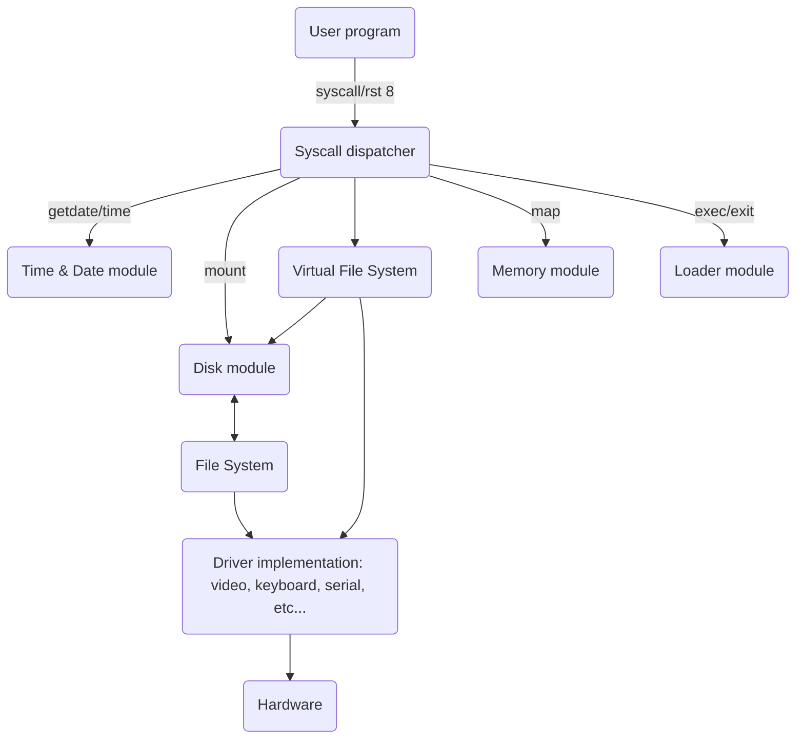

<p align="center">
    
</p>
<p align="center">
    <a href="https://opensource.org/licenses/Apache-2.0">
        
    </a>
    <p align="center">A simple and portable Operating System for Z80-based computers, written entirely in Z80 assembly.</p>
    <p align="center"><a href="https://www.youtube.com/watch?v=5jTcWRN8IbA">Click here to have a look at the video presentation of the project on Youtube</a></p>
</p>

## Table of Contents
- [About the project](#about-the-project)
  - [What?](#what)
  - [Why?](#why)
  - [Yet another OS?](#yet-another-os)
  - [Overview](#overview)
- [Getting started](#getting-started)
  - [Requirements](#requirements)
  - [Configuring Zeal 8-bit OS](#configuring-zeal-8-bit-os)
  - [Building](#building)
  - [Flashing](#flashing)
- [Features overview](#features-overview)
- [TO DO](#to-do)
- [Implementation details](#implementation-details)
  - [Memory Mapping](#memory-mapping)
  - [Kernel](#kernel)
    - [Used registers](#used-registers)
    - [Reset vectors](#reset-vectors)
  - [User space](#user-space)
  - [Syscalls](#syscalls)
    - [Syscall table](#syscall-table)
    - [Syscall parameters](#syscall-parameters)
  - [Drivers](#drivers)
  - [Virtual File System](#virtual-file-system)
    - [Architecture of the VFS](#architecture-of-the-vfs)
  - [Disks](#disks)
  - [File systems](#file-systems)
- [Supported targets](#supported-targets)
  - [Relation with the kernel](#relation-with-the-kernel)
  - [Zeal 8-bit Computer](#zeal-8-bit-computer)
  - [Porting to another machine](#porting-to-another-machine)
- [Version history](#version-history)
- [Contributing](#contributing)
- [License](#license)
- [Contact](#contact)

# About the project

## What?

Zeal 8-bit OS is an operating system written entirely in Z80 assembly for Z80 computers. It has been designed around simplicity and portability. It is inspired by Linux and CP/M. It has the concept of drivers and disks, while being ROM-able.

## Why?

As you may know, this project is in fact part of a bigger project called *Zeal 8-bit Computer*, which, as it name states, consists of an entirely newly designed 8-bit computer. It is based on a Z80 CPU.

When writing softwares, demos or drivers for it, I realized the code was tied to *Zeal 8-bit computer* hardware implementation, making them highly incompatible with any other Z80 computers, even if the required features were basic (only UART for example).

## Yet another OS?

Well, it's true that there are several (good) OS for the Z80 already such as SymbOS, Fuzix or even CP/M, but I wanted something less sophisticated:
not multithreaded, ROM-able, modular and configurable.
The goal is to have a small and concise ABI that lets us write software that can communicate with the hardware easily and with the least hardcoded behaviors.

While browsing the implementation details or this documentation, you will notice that some aspects are similar to Linux kernel, such as the syscall names or the way opened files and drivers are handled. Indeed, it was a great source of inspiration, but as it is a 32-bit only system, written in C, only the APIs/interfaces have been inspiring.

If you are familiar with Linux ABI/interface/system programming, then Zeal 8-bit OS will sound familiar!

## Overview

Currently, once compiled, the kernel itself takes less than 8KB of ROM (code), and less than 1KB of RAM (data).
Of course, this is highly dependent on the configuration. For example, increasing the maximum number of opened files, or the maximum length of paths will increase the size of the space used for data.

This size will increase as soon as more features will be implemented, for example when there will be more file systems. However, keep in mind that while writing the code, speed was more important than code size. In fact, nowadays, read-only memories are available in huge sizes and at a fair price.

Moreover, the OS can still be optimized in both speed and size. This is not the current priority but it means that we can still make it better! (as always)

To the kernel size, we have to add the drivers implementation size and the RAM used by them. Of course, this is highly dependent on the target machine itself, the features that are implemented and the amount of drivers we have.

The OS is designed to work with an MMU, thus, the target must have 4 swappable virtual pages of 16KB each. The pages must be interchangeable. More info about this in the [Memory Mapping](#memory-mapping) section.


# Getting started

## Requirements

At the moment, the project has only been assembled on Linux (Ubuntu 20.04), it should be compatible with Mac OS and Windows as long as you have:

* bash
* git (to clone this repo)
* make
* python3 with pip3. Used for the `menuconfig`.
* z88dk v2.2 (or later). Only its assembler, `z80asm`, is strictly required. The latest version of `z80asm` must be used as earlier versions don't have support for `MACRO`.

On Ubuntu, the following commands can be used to install the dependencies. They must be run as a user, not root!
```
sudo apt update
sudo apt install git python3 python3-pip
pip3 install --ignore-installed --user kconfiglib
```

For installing Z88DK, please [check out their Github project](https://github.com/z88dk/z88dk).

## Configuring Zeal 8-bit OS

After installing the dependencies listed above and cloning this repository, the first thing to do is to configure the OS. To do so, simply execute:
```
make menuconfig
```
From there, it is possible to configure the kernel but also the target computer's options, for example for *Zeal 8-bit computer*, it is possible to configure where the romdisk (more about this below) will be located on the ROM.

All the options have default values, so, if you have nothing to modify in particular or you are not sure what you are doing, press `S` to save the current (default) configuration. The filename for the configuration will be asked, keep it as `os.conf` and press enter.

To exit the menuconfig, press `Q` key. If everything goes well, the following message will be shown:
```
Converting os.conf to include/osconfig.asm ...
```

## Building

To build the OS (kernel + driver + target configuration), use the command:
```
make
```

After compiling, you should see the line:
```
OS binary: build/os.bin
```

Indicating that the final binary has been created. This binary includes the kernel code, the drivers, and the `romdisk` (more about this below)

## Flashing

The binary can be directly flashed to a ROM, to a NOR flash, or any other storage the target computer is using. It can also be used to boot an emulator.

For example, to flash it on an W27C020 (256KB) EEPROM, you can use a TL866xx programmer with `minipro` (https://gitlab.com/DavidGriffith/minipro/) and the following command:

```
minipro -w -S -p w27c020 build/os.bin
```

Of course, this is completely dependent on the target computer.

# Features overview

The kernel itself supports the following features:
* Mono-threaded system, the whole CPU is dedicated to running program!
* Up to 26 disks (A to Z)
* Files
* Directories
* Drivers
* Abstract opened "dev" which can represent an opened file, directory, or driver
* Real-Time Clock
* Timer (can be hardware or software timer)
* Up to 16MB physical address space divided as 256 banks of 16KB
* Open, read, write seek, close, ioctl drivers
* Open, read, write, seek, close, remove files
* Open, browse, close, remove directories
* Load raw binaries as init file. No dynamic relocation yet
* Syscalls to perform communication between user programs and kernel
* File systems ("rawtable" and ZealFS implemented yet)
* Modular build system, simplifying adding files and targets to the compilation

The only supported target at the moment is *Zeal 8-bit computer*, the port is not complete yet, the implemented features are:
* Video 640x480 text-mode
* UART as video card replacement (text-mode)
* UART for sending and receiving data
* MMU
* PS/2 keyboard
* I2C
* EEPROM (I2C)
* GPIO (partial)
* Free space in ROM used as a read-only `romdisk`, storing `init.bin` binary
* Linker script

# TO DO

There are still some work to do in the project. Some features needs to be development on the kernel side, some things needs to be documented in the project, here is a non-exhaustive list:
* <s>Generate header files usable by user programs for: syscalls, file entries, directories entries, opening flags, etc..</s> **Done, header files are available in `kernel_headers` directory.**
* <s>Document clearly what each syscall does</s> **Done, check ASM header file.**
* <s>A writable file system. Currently, only `rawtable` (more about it below) file system is implemented, which is read-only.</s> ZealFS file system has been implemented, it supports files and directories, and is writable!
* List the loaded drivers from a user program.
* List the available disks from a user program.
* Refactor the kernel code to have a proper memory module, with better names for the required macros.
* Come up with ABI and API for video, TTY, GPIO drivers, etc...
* Relocatable user programs. It is already possible to generate a relocation table when assembling a program with `z88dk-z80asm`.
* Lift some restrictions that can be avoided, such as having the user's program stack pointer in the last virtual page.
* Process all the `TODO` and `FIXME` left in the code.
* Make it work with MMU-less targets, and add a configuration option for this.
* Implement a software breakpoint with a reset vector.
* Optimize the code to be smaller and faster.
* *More things I am forgetting...*

And of course **fixing bugs!**

As Zeal 8-bit OS is still in beta version, you will encounter bugs, errors, problems, please feel free to open an issue, with a snippet of code to help reproducing it.

# Implementation details

In the sections below, the word "program", also referred to as "users programs", designates a software being executed after the kernel loaded it from a file and jumped to it.

## Memory Mapping

Zeal 8-bit OS can separate kernel RAM and user's program thanks to virtual pages. Indeed, as it is currently implemented, the kernel is aware of 4 virtual pages of 16KB.

The first page, page 0, shall not be switched as it contains the kernel code. This means that the OS binary is limited to 16KB, it must never exceed this size. When a user's program is being execute, any `syscall` will result in jumping in the first bank where the OS code resides. So if this page is switched for another purpose, no syscall, no interrupt nor communication with the kernel must happen, else, undefined behavior will occur.

The second page, page 1, is where user programs are copied to and executed from. Thus, all the programs for Zeal 8-bit OS shall be linked from address `0x4000` (16KB). When loading a program, the second and third page are also mapped to usable RAM from the user program. Thus, a user program can have a maximum size of 48KB.

The fourth page, page 3, is used to store the OS data for both the kernel and the drivers. When loading a user program, this page is switched to RAM, so that it's usable by the program, when a syscall occurs, it's switched back to the kernel RAM. Upon loading a user program, the SP (Stack Pointer) is set to `0xFFFF`. However, this may change in a near future.

To sum up, here is a diagram to show the usage of the memory:


*If the user program's parameters are pointed to a portion of memory in page 3 (last page), there is a conflict as the kernel will always remap its RAM page inside in that exact same page. This is why it will remap page 2 (third page) to let it contain the user parameter. Of course, the parameter will be decremented by 16KB to let it now point to the page 2.

## Kernel

### Used registers

Z80 presents multiple general-purpose registers, not all of them are used in the kernel, here is the scope of each of them:

| Register           | Scope                          |
| ------------------ | ------------------------------ |
| AF, BC, DE, HL     | System & application           |
| AF', BC', DE', HL' | Interrupt handlers             |
| IX, IY             | Application (unused in the OS) |

This means that the OS won't alter IX and IY registers, so they can be used freely in the application.

The alternate registers (names followed by `'`) may only be used in the interrupt handlers[^1]. An application should not use these registers. If for some reasons, you still have to use them, please consider disabling the interrupts during the time they are used:

```
my_routine:
                di              ; disable interrupt
                ex af, af'      ; exchange af with alternate af' registers
                [...]           ; use af'
                ex af, af'      ; exchange them back
                ei              ; re-enable interrupts
```

Keep in mind that disabling the interrupts for too long can be harmful as the system won't receive any signal from hardware (timers, keyboard, GPIOs...)

[^1]: They shall **not** be considered as non-volatile nonetheless. In other words, an interrupt handler shall not make the assumption that the data it wrote inside any alternate register will be kept until the next time it is called.

### Reset vectors

The Z80 provides 8 distinct reset vectors, as the system is meant to always be stored in the first virtual page of memory, these are all reserved to the OS:

Vector | Usage
------ | ------
$00 | Software reset
$08 | Syscall
$10 | Jumps to the address in HL (can be used for calling HL)
$18 | _Unused_
$20 | _Unused_
$28 | _Unused_
$30 | _Unused_
$38 | Reserved for Interrupt Mode 1, usable by the target implementation

## User space

## Syscalls

The system relies on syscalls in order to perform requests between the user program and the kernel. Thus, this shall the way to perform operations on the hardware. The list of possible operations are listed in the table below.

### Syscall table

Num  | Name | Param. 1 | Param. 2 | Param. 3
--------| ----- | --------| ---- | ----
0 | read | u8 dev | u16 buf | u16 size |
1 | write | u8 dev | u16 buf | u16 size |
2 | open | u16 name | u8 flags | |
3 | close | u8 dev | | |
4 | dstat | u8 dev | u16 dst | |
5 | stat | u16 name | u16 dst | |
6 | seek | u8 dev | u32 offset | u8 whence |
7 | ioctl | u8 dev | u8 cmd | u16 arg |
8 | mkdir | u16 path | | |
9 | chdir | u16 path | | |
10 | curdir | u16 path | | |
11 | opendir | u16 path | | |
12 | readdir | u8 dev | u16 dst | |
13 | rm | u16 path | | |
14 | mount | u8 dev | u8 letter | u8 fs |
15 | exit | | | |
16 | exec | u16 name | u16 argv | |
17 | dup | u8 dev | u8 ndev | |
18 | msleep | u16 duration | | |
19 | settime | u8 id | u16 time | |
20 | gettime | u8 id | u16 time | |
21 | setdate | u16 date | |
22 | getdate | u16 date | |
23 | map | u16 dst | u24 src | |

Please check the [section below](#syscall-parameters) for more information about each of these call and their parameters.

**NOTE**: Some syscalls may be unimplemented. For example, on computers where directories are not supported,directories-related syscalls may be omitted.

### Syscall parameters

In order to perform a syscall, the operation number must be stored in register `L`, the parameters must be stored following these rules:

| Parameter name in API | Z80 Register |
| --------------------- | ------------ |
| u8 dev                | `H`          |
| u8 ndev               | `E`          |
| u8 flags              | `H`          |
| u8 cmd                | `C`          |
| u8 letter             | `D`          |
| u8 fs                 | `E`          |
| u8 id                 | `H`          |
| u8 whence             | `A`          |
| u16 buf               | `DE`         |
| u16 size              | `BC`         |
| u16 name              | `BC`         |
| u16 dst               | `DE`         |
| u16 arg               | `DE`         |
| u16 path              | `DE`         |
| u16 argv              | `DE`         |
| u16 duration          | `DE`         |
| u16 time              | `DE`         |
| u16 date              | `DE`         |
| u24 src               | `HBC`        |
| u32 offset            | `BCDE`       |


And finally, the code must perform a `RST $08` instruction (please check [Reset vectors](#reset-vectors)).

The returned value is placed in A. The meaning of that value is specific to each call, please check the documentation of the concerned routines for more information.

## Drivers

A driver consists of a structure containing:

* Name of the driver, maximum 4 characters (filled with NULL char if shorter). For example, `SER0`, `SER1`, `I2C0`, etc. Non-ASCII characters are allowed but not advised.
* The address of an `init` routine, called when the kernel boots.
* The address of `read` routine, where parameters and return address are the same as in the syscall table.
* The address of `write` routine, same as above.
* The address of `open` routine, same as above.
* The address of `close` routine, same as above.
* The address of `seek` routine, same as above.
* The address of `ioctl` routine, same as above.
* The address of `deinit` routine, called when unloading the driver.

Here is the example of a simple driver registration:
```C
my_driver0_init:
        ; Register itself to the VFS
        ; Do something
        xor a ; Success
        ret
my_driver0_read:
        ; Do something
        ret
my_driver0_write:
        ; Do something
        ret
my_driver0_open:
        ; Do something
        ret
my_driver0_close:
        ; Do something
        ret
my_driver0_seek:
        ; Do something
        ret
my_driver0_ioctl:
        ; Do something
        ret
my_driver0_deinit:
        ; Do something
        ret

SECTION DRV_VECTORS
DEFB "DRV0"
DEFW my_driver0_init
DEFW my_driver0_read
DEFW my_driver0_write
DEFW my_driver0_open
DEFW my_driver0_close
DEFW my_driver0_seek
DEFW my_driver0_ioctl
DEFW my_driver0_deinit
```

Registering a driver consists in putting these information (structure) inside a section called `DRV_VECTORS`. The order is very important as any driver dependency shall be resolved at compile-time. For example, if driver `A` depends on driver `B`, then `B`'s structure must be put before `A` in the section `DRV_VECTORS`.

At boot, the `driver` component will browse the whole `DRV_VECTORS` section and initialize the drivers one by one by calling their `init` routine. If this routine returns `ERR_SUCCESS`, the driver will be registered and user programs can open it, read, write, ioctl, etc...

A driver, can be hidden to the programs, this is handy for disk drivers that must only be accessed by the kernel's file system layer. In order to be hidden, the `init` routine should return `ERR_DRIVER_HIDDEN`.

## Virtual File System

As the communication between applications and hardware is all done through the syscalls described above, we need a layer between the user application and the kernel that will determine whether we need to call a driver or a file system. Before showing the hierarchy of such architecture, let's talk about disks and drivers.

### Architecture of the VFS

The different layers can be seen like this:



## Disks

Zeal 8-bit OS supports up to 26 disks at once. The disks are denoted by a letter, from A to Z. It's the disk's driver responsibility to decide where to mount the disk in the system.

The first drive, `A`, is special as it is the one where the system will look for preferences or configuration.

In an application, a `path` may be:

* Relative to the current path, e.g. `my_dir2/file1.txt`
* Absolute, referring to the current disk, e.g. `/my_dir1/my_dir2/file1.txt`
* Absolute, referring to another disk, e.g. `B:/your_dir1/your_dir2/file2.txt`

## File systems

Even though the OS is completely ROM-able and doesn't need any file system or disk to boot, as soon as it will try to load the initial program, called `init.bin` by default, it will check for the default disk and request that file. Thus, even the most basic storage needs a file system, or something similar.

* The first "file system" that is supported in Zeal 8-bit OS is called "rawtable". As it name states, it represents the succession of files, not directories, in a storage device, in no particular order. The file name size limit is the same as the kernel's: 16 characters, including the optional `.` and extension. If we want to compare it to C code, it would be an array of structure defining each file, following by the files content in the same order. A romdisk packer source code is available in the `packer/` at the root of this repo. Check [its README](packer/README.md) for more info about it.

* The second file system that is implemented is named ZealFS. Its main purpose is to be embedded in very small storages, from 8KB up to 64KB. It is readable and writable, it supports files and directories. [More info about it in the dedicated repository](https://github.com/Zeal8bit/ZealFS).

* The third file system that would be nice to have on Zeal 8-bit OS is FAT16. Very famous, already supported by almost all desktop operating systems, usable on CompactFlash and even SD cards, this is almost a must have. It has **not** been implemented yet, but it's planned. FAT16 is not perfect though as it is not adapted for small storages, this is why ZealFS is needed.

# Supported targets

## Relation with the kernel

The Zeal 8-bit OS is based around two main components: a kernel and a target code.
The kernel alone does nothing. The target needs to implement the drivers, some MMU macros used inside the kernel and a linker script. The linker script is fairly simple, it lists the sections in the order they must be linked in the final binary by `z80asm` assembler.

The kernel currently use the following sections, which must be included in any linker script:
* `RST_VECTORS`: contains the reset vectors
* `SYSCALL_ROUTINES`: contains the syscall dispatcher, called from a reset vector
* `KERNEL_TEXT`: contains the kernel code
* `KERNEL_STRLIB`: contains the string-related routines used in the kernel
* `KERNEL_BSS`: contains the data used by the kernel code, **must** be in RAM
* `KERNEL_DRV_VECTORS`: represents an array of drivers to initialize, check [Driver section](#drivers) for more details.
* `DRIVER_BSS`: not used directly by the kernel, it shall be defined and used in the drivers. The kernel will set it to 0s on boot, it must be bigger than 2 bytes

## Zeal 8-bit Computer

As said previously, *Zeal 8-bit Computer* support is still partial but enough to have a command line program running. The romdisk is created before the kernel builds, this is done in the `script.sh` specified in the `target/zeal8bit/unit.mk`.

That script will compile the `init.bin` program and embed it inside a romdisk that will be concatenated to the compiled OS binary. The final binary can be directly flashed to the NOR Flash.

What still needs to be implemented, in no particular order:
* <s>UART driver</s> **Done**
* I2C driver (**partially done**)
  * EEPROM driver (needs ZealFS)
  * RTC driver
* GPIO user interface/API
* Video graphics mode
* Video API
* SD card support
* Sound support
* Hardware timers (based on V-blank and H-blank signals)

## Porting to another machine

In order to port Zeal 8-bit OS to another machine, make sure you have an MMU first which divides the Z80's 64KB address space into 4 pages of 16KB. That's the main requirement, if that's the case, you can proceed.

* Open the `Kconfig` file at the root of this repo, add an entry to the `config TARGET` and `config COMPILATION_TARGET` options. Take example on the ones that are already present.
* Create a new directory in `target/` for your target, the name **must** be the same as the one specified in the new `config TARGET` option.
* Inside this new directory, create a new `unit.mk` file. This is the file that shall contain all the source files to assemble or the ones to include.
* Populate your `unit.mk` file, to do os, you can to populate the following `make` variables:
  * `SRCS`: list of the files to be assembled. Typically, these are the drivers (mandatory)
  * `INCLUDES`: the directories containing header files that can be included
  * `PRECMD`: a bash command to be executed **before** the kernel starts building
  * `POSTCMD`: a bash command to be execute **after** the kernel finishes building
* Create the assembly code that implements the drivers for the target
* Create an `mmu_h.asm` file which will be included by the kernel to configure and use the MMU. Check the file [`target/zeal8bit/include/mmu_h.asm`](target/zeal8bit/include/mmu_h.asm) to see how it should look like.
* Make sure to have at least one driver that mounts a disk, with the routine `zos_disks_mount`, containing an `init.bin` file, loaded and executed by the kernel on boot.
* Make sure to have at least one driver which registers itself as the standard out (stdout) with the routine `zos_vfs_set_stdout`.

# Version history

For the complete changelog, [please check the release page](https://github.com/Zeal8bit/Zeal-8-bit-OS/releases/).

# Contributing

Contributions are welcome! Feel free to fix any bug that you may see or encounter, or implement any feature that you find important.

To contribute:
  * Fork the Project
  * Create your feature Branch (*optional*)
  * Commit your changes. Please make a clear and concise commit message (*)
  * Push to the branch
  * Open a Pull Request


(*) A good commit message is as follow:
```
Module: add/fix/remove a from b

Explanation on what/how/why
```
For example:
```
Disks: implement a get_default_disk routine

It is now possible to retrieve the default disk of the system.
```

# License

Distributed under the Apache 2.0 License. See `LICENSE` file for more information.

You are free to use it for personal and commercial use, the boilerplate present in each file must not be removed.

# Contact

For any suggestion or request, you can contact me at contact [at] zeal8bit [dot] com

For features requests, you can also open an issue or a pull request.
