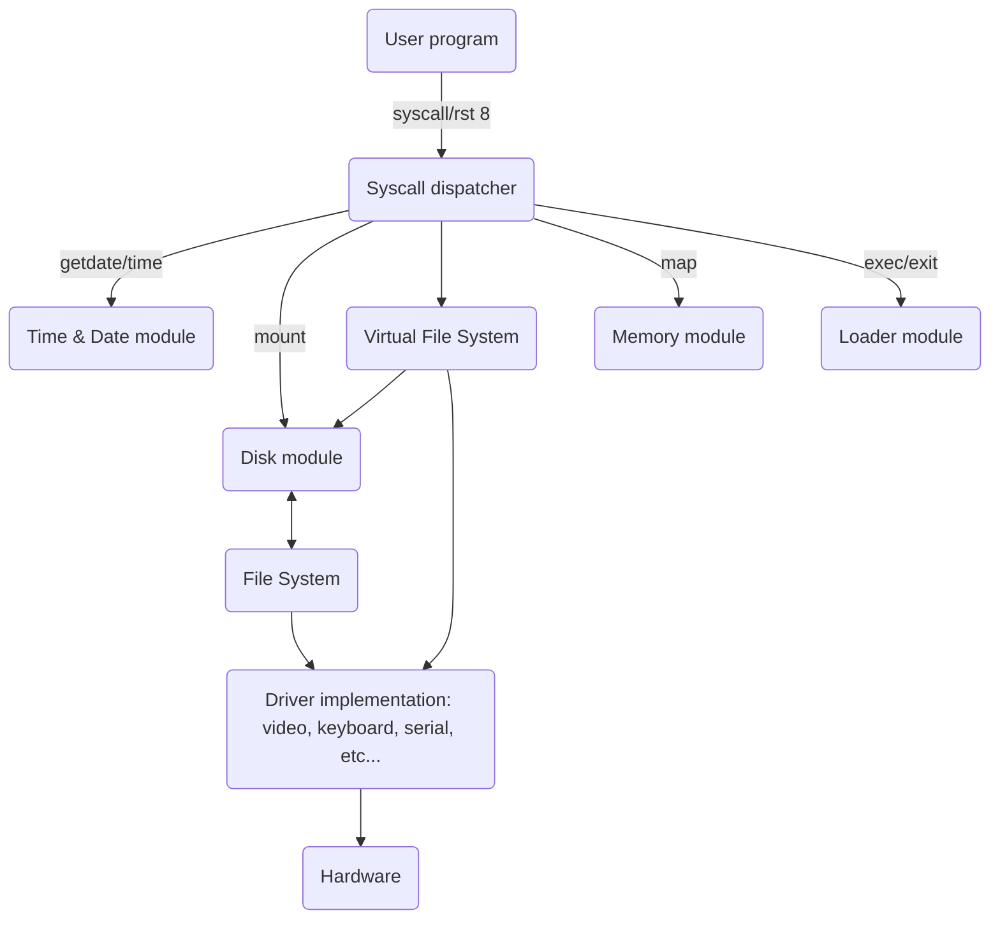

As the communication between applications and hardware is all done through the syscalls described above, we need a layer between the user application and the kernel that will determine whether we need to call a driver or a file system. Before showing the hierarchy of such architecture, let's talk about disks and drivers.

## Architecture of the VFS

The different layers can be seen like this:

## Disks

Zeal 8-bit OS supports up to 26 disks at once. The disks are denoted by a letter, from A to Z. It's the disk driver's responsibility to decide where to mount the disk in the system.

The first drive, `A`, is special as it is the one where the system will look for preferences or configurations.

In an application, a `path` may be:

* Relative to the current path, e.g. `my_dir2/file1.txt`
* Absolute, referring to the current disk, e.g. `/my_dir1/my_dir2/file1.txt`
* Absolute, referring to another disk, e.g. `B:/your_dir1/your_dir2/file2.txt`

## File systems

Even though the OS is completely ROM-able and doesn't need any file system or disk to boot, as soon as it will try to load the initial program, called `init.bin` by default, it will check for the default disk and request that file. Thus, even the most basic storage needs a file system, or something similar.

* The first "file system", which is already implemented, is called "rawtable". As its name states, it represents the succession of files, not directories, in a storage device, in no particular order. The file name size limit is the same as the kernel's: 16 characters, including the optional `.` and extension. If we want to compare it to C code, it would be an array of structures defining each file, followed by the file's content in the same order. A romdisk packer source code is available in the `packer/` at the root of this repo. Check [its README](https://github.com/Zeal8bit/Zeal-8-bit-OS/blob/main/packer/README.md) for more info about it.

* The second file system, which is also implemented, is named ZealFS. Its main purpose is to be embedded in very small storages, from 8KB up to 64KB. It is readable and writable, it supports files and directories. [More info about it in the dedicated repository](https://github.com/Zeal8bit/ZealFS).

* The third file system that would be nice to have on Zeal 8-bit OS is FAT16. Very famous, already supported by almost all desktop operating systems, usable on CompactFlash and even SD cards, this is almost a must-have. It has **not** been implemented yet, but it's planned. FAT16 is not perfect though as it is not adapted for small storage, this is why ZealFS is needed.
