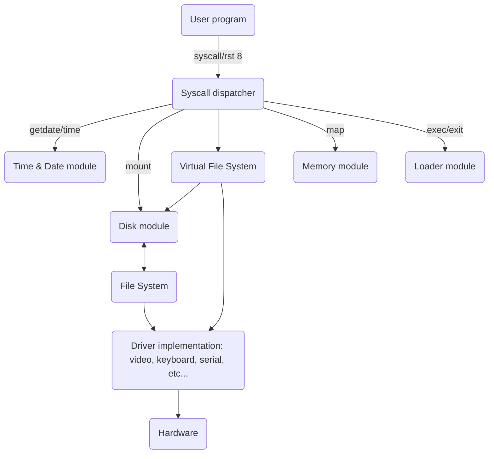

As the communication between applications and hardware is all done through the syscalls described above, we need a layer between the user application and the kernel that will determine whether we need to call a driver or a file system. Before showing the hierarchy of such architecture, let's talk about disks and drivers.

## Architecture of the VFS

The different layers can be seen like this:

